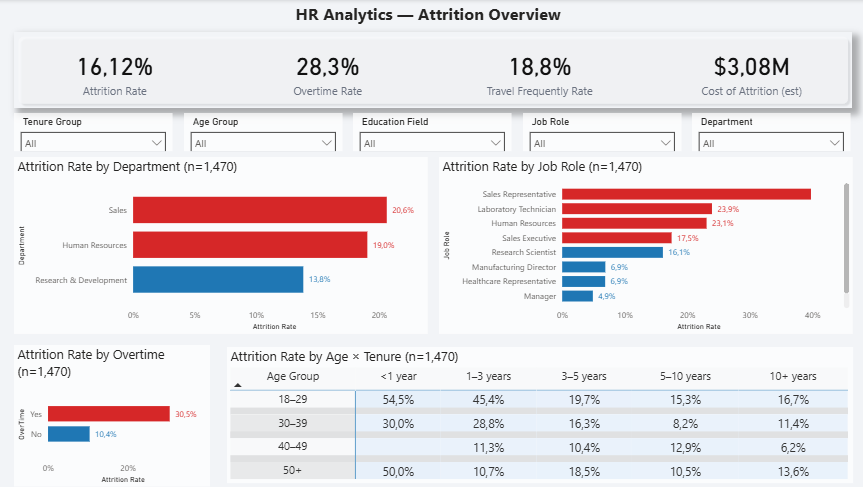

# HR Analytics — Attrition & Tenure (Case Study)



**TL;DR.** Overall attrition is **16.1%** (n=1,470). The largest risk drivers in this sample are **Overtime**, **Travel Frequently**, and **Early Tenure (<1 year)**. A small set of roles carries a disproportionate share of exits. With a conservative replacement assumption of **2 months of salary**, estimated **Cost of Attrition ≈ $3.08M**. Focused actions on those drivers are likely to produce fast, measurable savings.

---

## Business question
> *Where are we losing people, why, and what can we do right now that’s both impactful and pragmatic?*

- **Audience:** People Ops, HRBPs, Business Leaders  
- **Outcomes:** 1) find **drivers**, 2) identify **high-risk cohorts**, 3) propose **quick wins** with cost impact

**Dataset.** [IBM HR (public)] — classic anonymized HR sample for analytics demos.

---

## Approach & Model

**Tools:** Power BI (Power Query + DAX)

**Data shaping (Power Query)**
- Renamed columns for readability (e.g., `YearsAtCompany` → “Years at Company”).
- Derived **Age Group** (18–29, 30–39, 40–49, 50+) and **Tenure Group** (<1, 1–3, 3–5, 5–10, 10+).
- Cleaned categories; kept the model **single-table** (star-lite) for simplicity.

**Key measures (DAX)**
```DAX
Attrition Count := COUNTROWS(FILTER('HRData','HRData'[Attrition]="Yes"))

Attrition Rate :=
DIVIDE([Attrition Count], COUNTROWS('HRData'))

Overall Attrition Rate :=
CALCULATE([Attrition Rate], ALL('HRData'))

Bar Color (Risk) :=
VAR r = [Attrition Rate]
RETURN IF(r >= [Overall Attrition Rate], "#D62728", "#1F77B4")  -- red if above avg

Replacement Months (sel) := COALESCE(SELECTEDVALUE(Assumptions[Replacement Months]), 2)

Cost of Attrition (est) :=
[Attrition Count] * ( [Avg Monthly Income] * [Replacement Months (sel)] )
